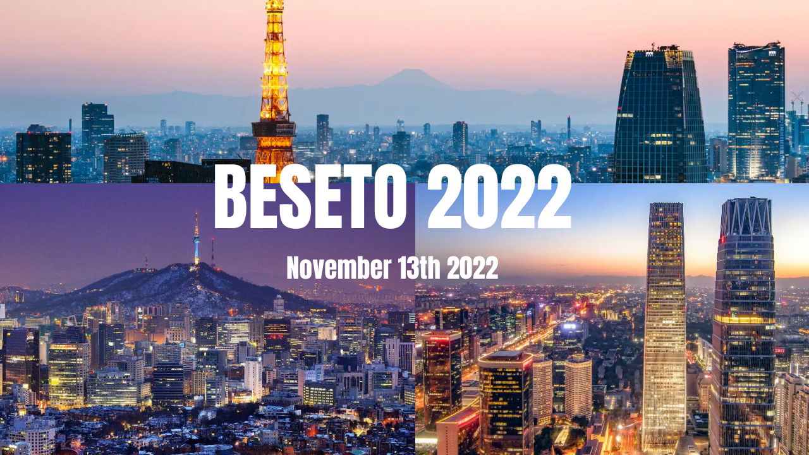
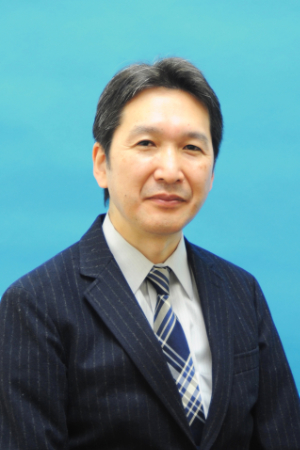
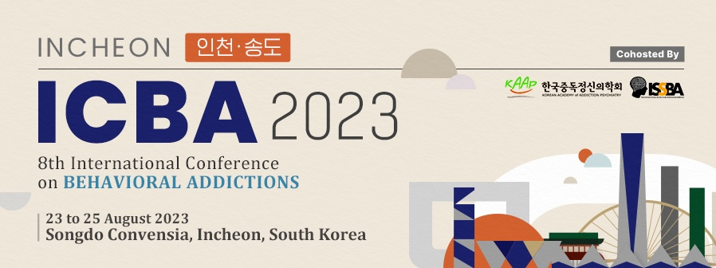

The BESETO International Psychiatry Conference is an international conference held every year jointly by the psychiatric departments at Seoul National University, Peking University, and the University of Tokyo.

This year the conference is hosted by the Department of Neuropsychiatry, the University of Tokyo, in collaboration with the Human behavioral science for subjectification ("tojisha-ka") : interaction-based & rule-/story-based understanding of the brain & the world.

<h3 class="pb-2 pt-4" style="font-weight: 300;">Message from the Chair</h3>

<figure class="figure float-right ml-4">
  
  <figcaption class="figure-caption">Kiyoto Kasai, M.D., Ph.D. Professor and Chair, Department of Neuropsychiatry, The University of Tokyo</figcaption>
</figure>

It is a great honor to host BESETO in 2022. We look forward to a lively discussion and exchange of ideas, albeit online. 
A decade has passed since the first BESETO was held in Seoul in 2012, and the baton has been passed on to Beijing in 2013 and Tokyo in 2014. 
As an international conference of leading psychiatric departments in Korea, China, and Japan, BESETO has played an extremely important role in the development of mental health care in Asia. This year, we have planned a special lecture by Dr. Shin-ichiro Kumagaya, a leading expert on "tojisha-kenkyu", which is appropriate for the era of co-production. Tojisha-kenkyu is unique in that the person who has experienced disabilities plays a leading role in creating knowledge about the difficulties and how to deal with them, with peer participants taking action together. They start from the point of having to cope with difficulties in daily life and then communicate this information to society as a means of eliminating the mismatch between the individual and the world. The concept of tojisha-kenkyu is now being communicated internationally by Dr. Kumagaya and colleagues. Let us enjoy his lecture! 
We sincerely hope that the 2022 BESETO meeting is fruitful and successful enough to facilitate both scientific and cultural co-exchanges among young clinicians and researchers from the three countries. Let's continue to make progress toward better mental health care in Asia and the world.

<h3 class="pb-2 pt-4" style="font-weight: 300;">Links</h3>

